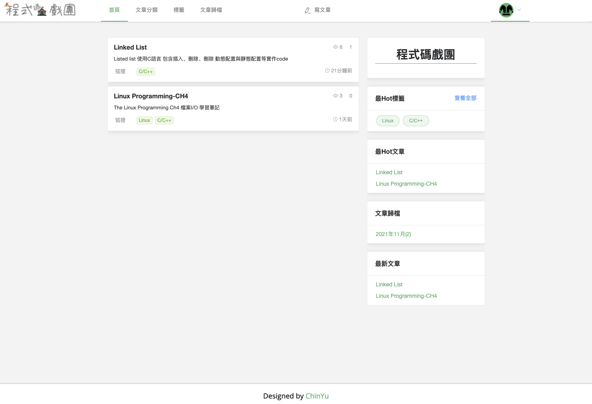
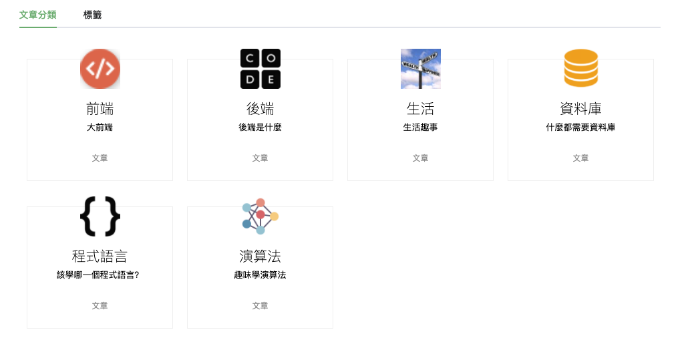
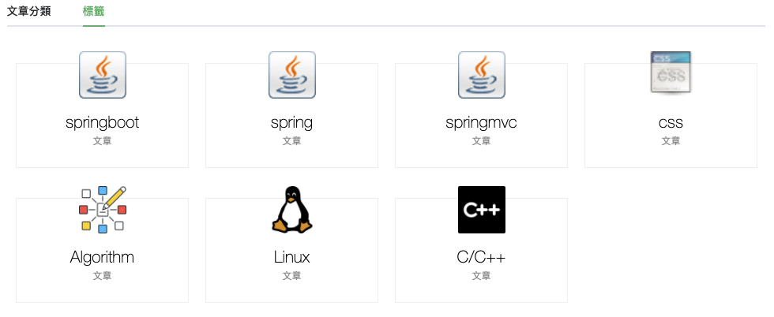
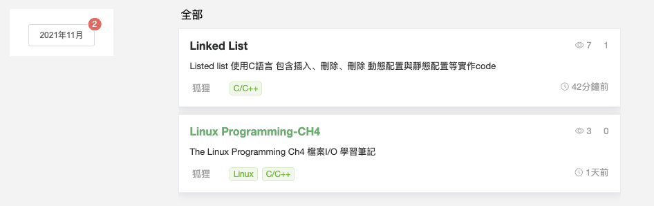
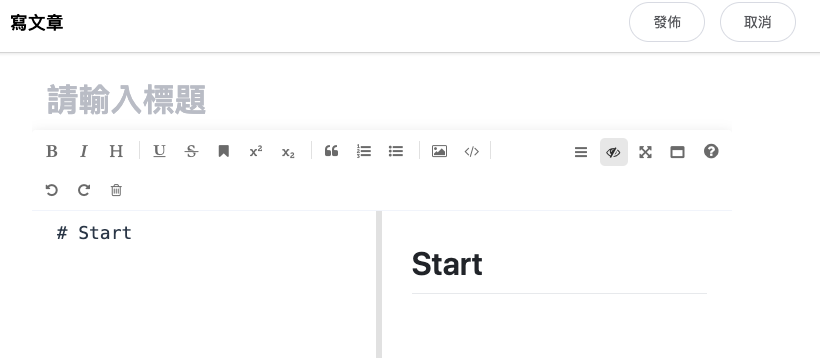
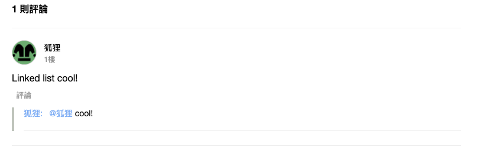
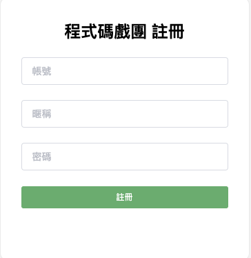
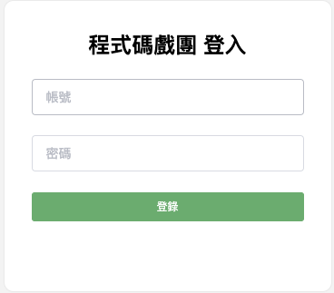
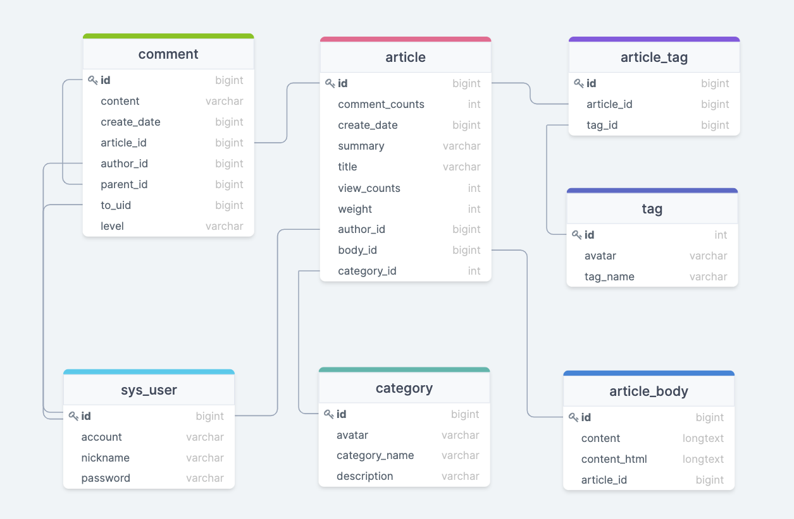

# SpringBoot - Blog

## About The Project
前後端分離，使用SpringBoot開發後端環境，主要有：
1. 文章(筆記)列表顯示
2. hot tags, hot articles, new文章顯示
3. 登入、註冊、登出
4. 閱讀次數與評論次數顯示
5. 評論功能（包含回覆評論功能）
6. 發文功能（使用md編輯器tools）

### Built With
* JDK : 1.8
* FrontEnd : Vue 4.5.13
* BackEnd : SpringBoot 2.x
* Persistence Framework : MyBatisPlus
* DataBase : Mysql
* Cache : Redis
  
## Getting Started

### Prerequisites
FrontEnd:
* npm
  ```npm
  npm install
  npm run build
  npm run dev
  ```

## Introduction 

### Home page
有導航列：文章分類、tag、歸檔等處理，條列式的列出文章  
有顯現出各hot與最新的文章（前五則） 



### tag & category page
按進分類或標籤中，即會列出該分類或該標籤所有的文章

 

### Archive page
會根據年月 列出X年X月的所有文章




### Write Article page

markdown model
可以直接使用markdown模式寫文章，寫完即會在右方顯示結果



### comment
有回應功能。用sql記錄這則評論是在哪個level以及其回應對象即可實現




### register & login
註冊與登入功能，註冊與登入的密碼使用`md5`加密。 
登入在後端實作時採用JWT的方式，JWT可以生成一個加密的token，當帳戶登入成功後，會發給客戶端，當request一個需要登入的interface時，可以用此token讓後端驗證token是否合法
並且將token保存在redis中，以便快速安全的驗證token

 


## Optimization

### Spring Cache 
製作一個自訂的annotation，其code在`common/cache/Cache` `common/cache/CacheAspect`中
使用spring annotation `@Cache` 在需要快速讀取的postmapping或getmapping加上 `@Cache(expire, name)`


## SQL Table
SQL 關聯表




### 待開發
* 部署上線
* domain name 註冊
* 評論資料放進mangodb

  